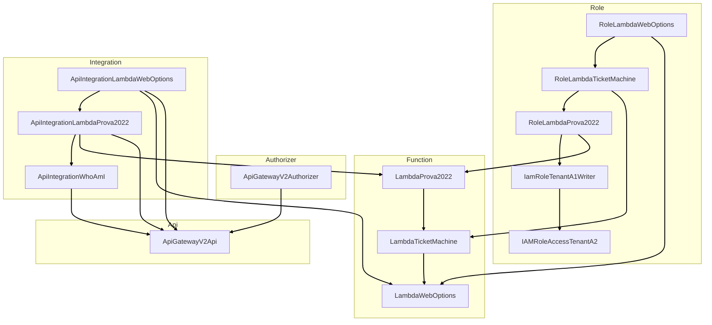

prova

```mermaid


flowchart TD
	subgraph Api
	direction TB
	ApiGatewayV2Api
	end

	subgraph Function
	direction TB
	LambdaProva2022
	LambdaTicketMachine
	LambdaWebOptions
	LambdaProva2022-->LambdaTicketMachine-->LambdaWebOptions
	end

	subgraph Role
	direction TB
	RoleLambdaWebOptions
	RoleLambdaTicketMachine
	RoleLambdaProva2022
	IamRoleTenantA1Writer
	IAMRoleAccessTenantA2

	RoleLambdaWebOptions-->RoleLambdaTicketMachine-->RoleLambdaProva2022-->IamRoleTenantA1Writer-->IAMRoleAccessTenantA2

	end

	subgraph Authorizer
	direction LR
	ApiGatewayV2Authorizer
	end

	subgraph Integration
	direction LR
	ApiIntegrationLambdaWebOptions
	ApiIntegrationLambdaProva2022
	ApiIntegrationWhoAmI
	ApiIntegrationLambdaWebOptions-->ApiIntegrationLambdaProva2022-->ApiIntegrationWhoAmI
	end

	RoleLambdaWebOptions --> LambdaWebOptions
	RoleLambdaTicketMachine --> LambdaTicketMachine
	RoleLambdaProva2022 --> LambdaProva2022
	ApiIntegrationLambdaWebOptions --> LambdaWebOptions
	ApiIntegrationLambdaWebOptions --> ApiGatewayV2Api
	ApiIntegrationLambdaProva2022 --> LambdaProva2022
	ApiIntegrationLambdaProva2022 --> ApiGatewayV2Api
	ApiIntegrationWhoAmI --> ApiGatewayV2Api
	ApiGatewayV2Authorizer --> ApiGatewayV2Api

linkStyle default stroke-width:2px,fill:none,stroke:black;

```
